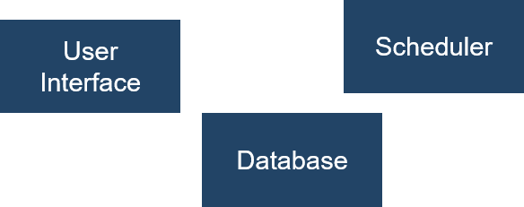
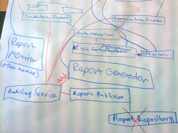
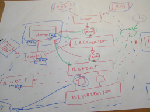
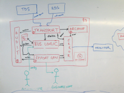
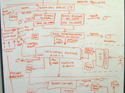
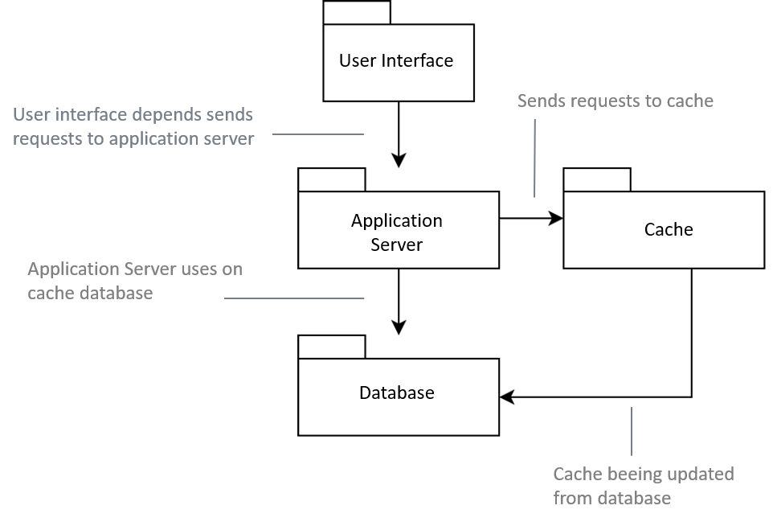
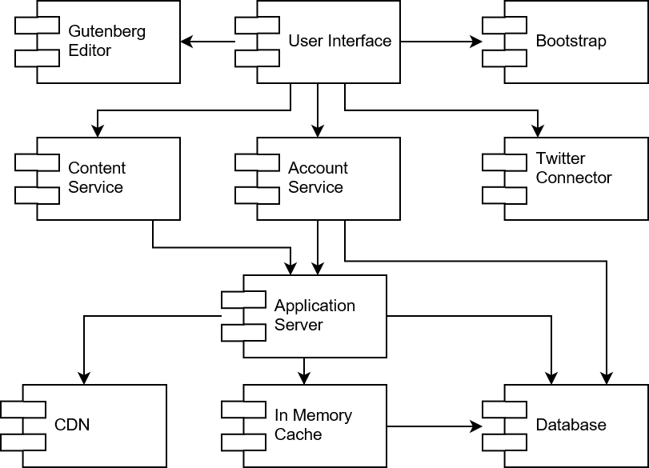

# Advandes Software Architecture

Prof. Dr.-Ing. Andreas Heil

 Licensed under a Creative Commons Attribution 4.0 International license. Icons by The Noun Project.

v1.0.0

---

# Software Architecture 
## Introduction

---
# What is an Architectural Style

What is an »architectural style«?

  

---

# Architctural Style Example

* An example: Gothic style 
* Gothic style provides the following features:
    * cross-ribbed vault
    * two instead of fuor roman archs 
    * high, broken-up walls
    * rose windows
    * pointed archs
    * gothic buttress
 
---

# Architctural Style Example

* An example: Instance of Gothic style 
* Gothic style provides the following features:
    * cross-ribbed vault
    * two instead of fuor roman archs 
    * high, broken-up walls
    * rose windows
    * pointed archs
    * gothic buttress
    
 

---

# Software Architecture vs Software Design

---

# Software Architecture

Technopedia says[^2]:

> Software architecture is a structured framework used to **conceptualize software elements, relationships and properties**. This term also references software architecture documentation, which facilitates stakeholder communication while **documenting early and high-level decisions regarding design and design component and pattern reuse for different projects. The software architecture process works through the abstraction and separation of these concerns to reduce complexity.

[^2]: https://www.techopedia.com/definition/24596/software-architecture

---

# Software Design

Ian Simmerville, Software Engineering, 10. Edition:

> Architectural design is concerned with understanding how a system should be organized and designing the overall structure of that system. In the model of the software development process, […], architectural design is the first stage in the software design process. It is the critical link between design and requirements engineering, as it identifies the main structural components in a system and the relationships between them. The output of the architectural design process is an architectural model that describes how the system is organized as a set of communicating components.

---

# Software Architecture Design 
## The Process of Describing Software Architectures 

---

# From Boxes...

* Software architecture based on the process: »software architect design«
* Software architecture design is a process where data structures, algorithms and software components are oganized in a way to achieve the desired behavior of a system
* Requirements are mapped to software components

 

---

# ... and Lines

* Relationships between components usually consist of 
    * control flows 
    * data flows 
    * dependencies
* The collaboration of the components is described using these relationships

 

---

# How to Choose Architectures

## Practical tips

* The is not the »one an only« architecture for a requirement
* Requirements can be fulfilled using various architectures
* New technologies might require an architectural change
* Architectures are often based on the experience, external factors (e.g. company guidelines) or even the personal preferences of an architect

Let me tell you something a true story about someone who wanted to call himself an »Architect«...

---

# Levels of Abstraction

* To fuilly describe an architecture you probalby need various levels of abstraction
* Examples
    * Static view (system components)
    * Dynamic view (processes, programm sequence)
    * Developer view (classes, packages)
    * Phyiscal view (infrastructure, physical components)
    * Deployment view (virtual machines, containers)

* Use different views based on your needs 
* **Good bet: Do not put everything on one single view - been there, seen it!**

---

# Documentation Approaches

* There are various approaches how to docment software architectures

* Architectural description languages (ADL): Formal languages which allow you to talk about architectures
* Various research projects do exists[^2]
* UML-based approaches: ArchMate, SysML 

* Problem 1: No or little acceptance within the industry 
* Problem 2: Formal approaches are neglected in favor for the much simpler boxes and lines 

**Consequence: simple boxes and lines are the most common approach for documenting and communicating architectures**

[^2]: http://www.di.univaq.it/malavolta/al/

---

# Software Architecture Challenge 

* These are real world examples[^3]
* Would you be able to build the drawn system based on those architectural drawings?

    

[^3]: https://c4model.com/

---

# Usage of UML (1)

* Usage of UML package structures
* Bear in mind, there is only *one* view on the architecture 
* But you see various levels ob abstractions

 

---

# Usage of UML (2)

* Usage of UML component structure 
* This is *another* view on the previous architecture 
* Still different levels of abstractions 

 

---

# Acknowledgments 

Photographs used under public domain or fair usage. No copyright infringement intended. If used accidently under wrong license please contact to be removed.
